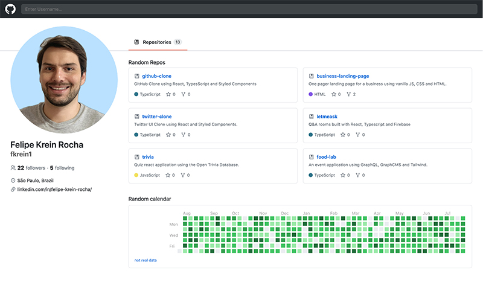
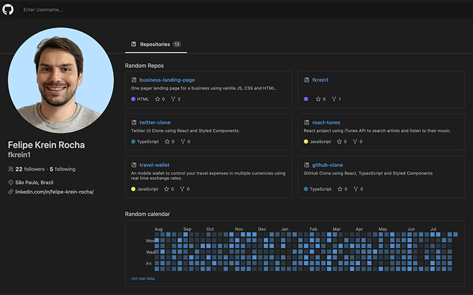

# GitHub UI Clone
A responsive clone of GitHub Interface using React, Typescript and Styled Components with light and dark mode.
 
 
<a href="https://github-clone-lovat.vercel.app/">GitHub UI Clone Webpage</a>
 
 

 

